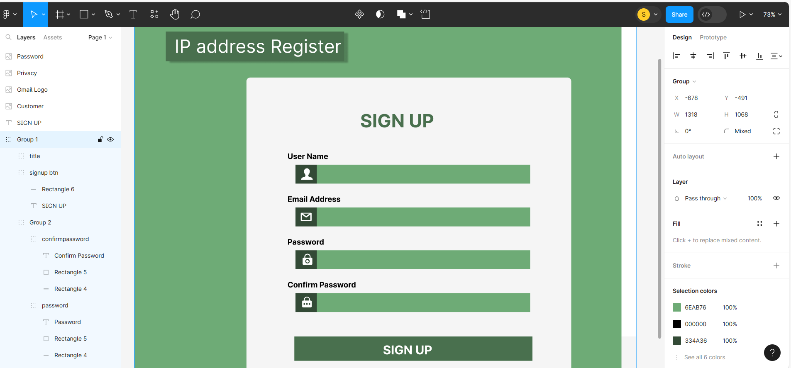
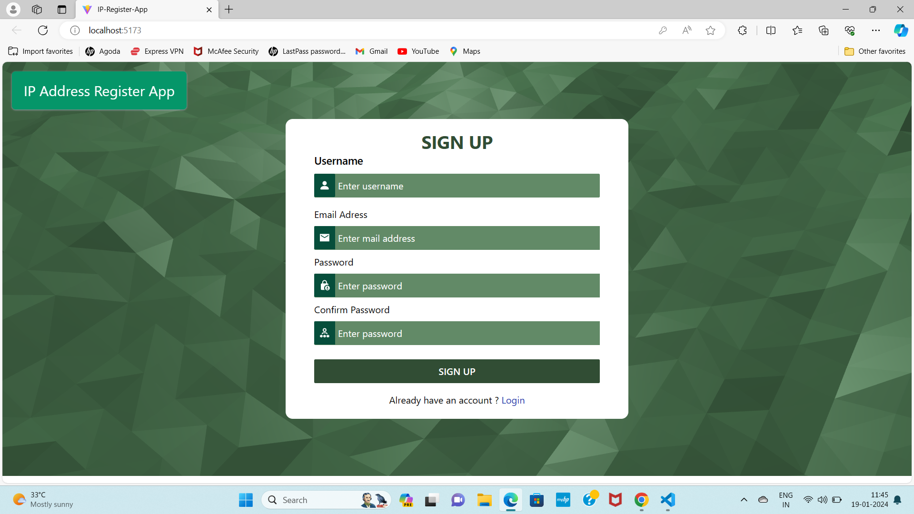

# Javascript Challenge

This challenge is part of free internship (Fullstack Engineer) offered by [CyberDude Networks Pvt. Ltd.](https://cyberdudenetworks.com) You can find all the source code and live links below.

## IP-Registration App

The concept is, to create a signup and login, once you loggined in, it must show all the login history as well as the IP address.

## Hand Sketch

## Figma early development

## Final Output Sketch

## Acknowledgement

I would like to thank my Guide and Mentor Mr.AnbuSelvan,for his guidance.

## References:

If you need any reference or help, you can watch this .

## Contribute

If you love to contribute to my project, then you can do with deleting login information as well as more mobile friendly.

## License

[MIT](https://choosealicense.com/licenses/mit/)
